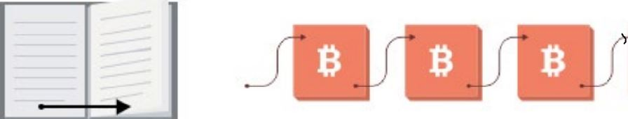
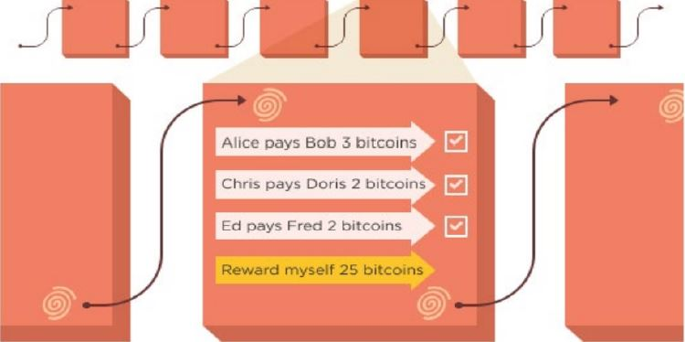

### What is Blockchain?
#### Blockchain is a decentralized distributed ledger (data structure) where data is being stored inside blocks in form of transactions

Blockchain is a data structure, which is arrange of data in computer memory, such as Excel sheet, Google Doc and PDF files.

Suppose that we have a book, in which each page make reference for the previous page through a page number one less than a current page number. We can detect and identify the removal of a page when a page has been removed through the page number.

| Book Ordering | Block Ordering |
|--------------|---------------|
| Page 1,2,3,4,5 | Block "88m795" built on "48m775",  Block "87m885" built on "88m795",  Block "5l8ugO" built on "87m885" | 
| Implicit that the page builds on the pages whose Number is one less(page 5 builds on page 4)(5 minus 1) | "48m775", "88m795", "87m885", "5l8ugO" represent fingerprints or hashes of the blocks.  | 

Also, we can detect the alteration of contents of specific page through page number.
>If anyone changes the content of the page,  then the next page number will not match. 
>since the page number is produced by crunching the content of the previous page.    

Blockchain has the similar mechanism as the book, each block is built on top of the recent block and use its
previous block’s content as a signature. Building a block & adding it in the Blockchain is the task of the miner nodes

* In public Blockchain it is made computationally difficult to add a block to prevent
attacks.

* Miners try to guess a number in such a way that if it gets crunched with the most
recent block’s fingerprint than it will create a new fingerprint which will be less that the
last/most recent block in the Blockchain.

* It takes time & computational power to add a Block in the Blockchain. Hence there is
some reward (25 BTC in case of Bitcoin Blockchain)

* Private Blockchain can chose other methods to add a block as they can trust the
miners using a contract etc.

### What is Smart Contract?
#### Smart contract is a term used to describe computer program code that is capable of facilitating, executing, and enforcing the negotiation or performance of an agreement (i.e. contract) using blockchain technology.

* The entire process is automated can act as a complement, or substitute, for legal contracts, where the terms of the smart contract are recorded in a computer language as a set of instructions.

### What is Ethereum Virtual Machine ?
* Ethereum is a programmable Blockchain
* It allows user to create their own operations
* Ethereum in the narrow sense refers to a suite of protocols that define a platform for decentralized applications.
* At the heart of it is the Ethereum Virtual Machine (“EVM”), which can execute code of arbitrary algorithmic complexity.
* In computer science terms, Ethereum is [“Turing complete”](https://www.quora.com/What-is-meant-by-Turing-complete-languages-and-which-programming-languages-comes-under-this).
* Developers can create applications that run on the EVM using friendly programming languages modelled on existing languages like JavaScript and Python.

### What is SOLIDITY?
* High-level object-oriented language for smart contratcs
* Solidity was initially proposed in August 2014 by Gavin Wood
* Solidity lets you program on Ethereum, a blockchain-based virtual machine
* Solidity is a statically typed programming language
* A Contract programming language that has similarities to Javascript and C
* Contract-specific features include modifier (guard) clauses, event notifiers for listeners, and custom global variables.
* Solidity is compiled to bytecode that is executable on the EVM

## Click following link for further learning !

## [Making New Cryptocurrency using Ethereum Blockchain and SOLIDITY](http://www.patternics.com/blockchain/create_new_cryptocurrency)

## [Smart Contract programming using Ethereum SOLIDITY](http://www.patternics.com/blockchain/smart_contract)

## [Bitcoin concept and programming](http://www.patternics.com/blockchain/bitcoin)

## Installation and usage
Program is written in java, solidity. it one may need solidity shoulde be installed ( https://docs.continuum.io/anaconda/install ) or install python 2.7 and then install Numpy, Scipy, Pandas, matplotlib,jupyter manually as follows.
#### Remix
If you just want to try Solidity for small contracts, you can try Remix which does not need any installation. If you want to use it without connection to the Internet, you can go to https://github.com/ethereum/browser-solidity/tree/gh-pages and download the .ZIP file as explained on that page.

#### npm / Node.js
This is probably the most portable and most convenient way to install Solidity locally.

A platform-independent JavaScript library is provided by compiling the C++ source into JavaScript using Emscripten. It can be used in projects directly (such as Remix). Please refer to the solc-js repository for instructions.

It also contains a commandline tool called solcjs, which can be installed via npm:

> npm install -g solc

#### Docker
We provide up to date docker builds for the compiler. The stable repository contains released versions while the nightly repository contains potentially unstable changes in the develop branch.

> docker run ethereum/solc:stable solc --version

> Acknowledgement : Some images and articles are from other sites or materials - Toshendra Sharma : Ethereum development,
Rafael pass : a Course in Cryptography, Arvind Narayanan, Joseph Bonneau : Bitcoin and Cryptocurrency Technologies,
Ravinder Deol : Ethereum Blockchain

### Meta

Yoonsu Park - http://www.patternics.com Distributed under the MIT license. See LICENSE for more information( https://en.wikipedia.org/wiki/MIT_License ). https://github.com/blockchain99/blockchain
